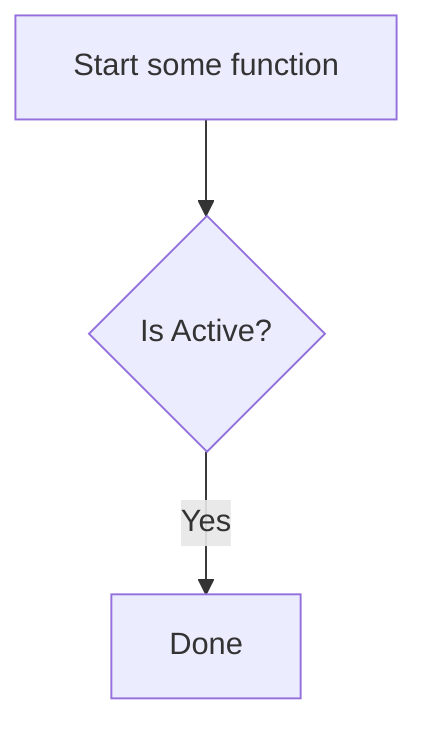

# 2020 summer


### *draw flow chart use markdown with mermaid


**use this code**

```
graph TD
  start[Start some function]
  isActive{Is Active?}
  done[Done]
  
  start --> isActive
  isActive -->|Yes| done
```
### example of code language ###
```python
def a():
  print("asd")
```

```kotlin
fun a() {
    print("asd")
}
```

```xml
<android>
  <a>b</a>
</android>
```

```html
<h1>asdf</h1>
```

